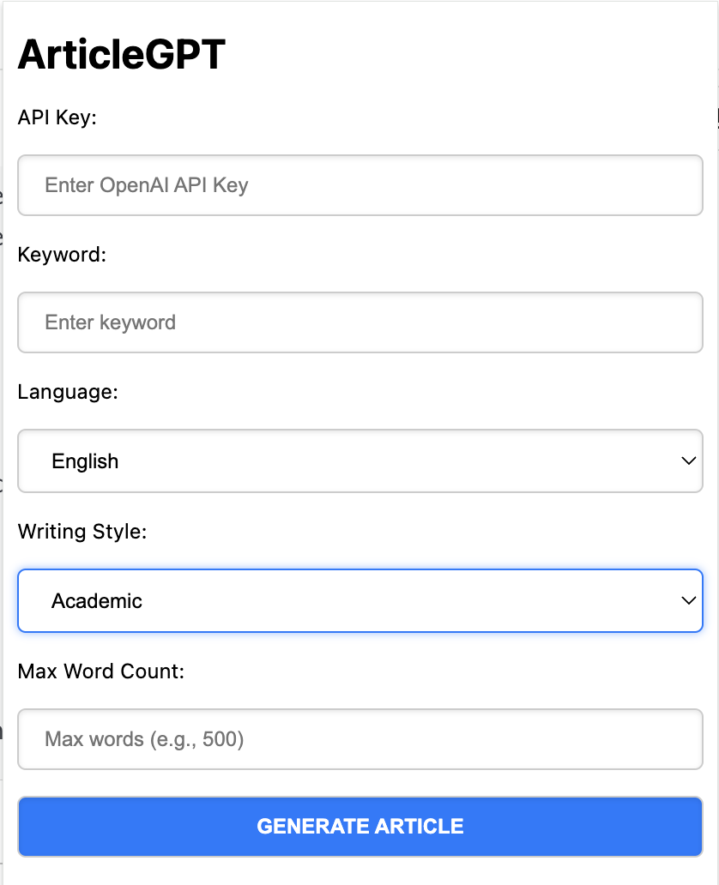
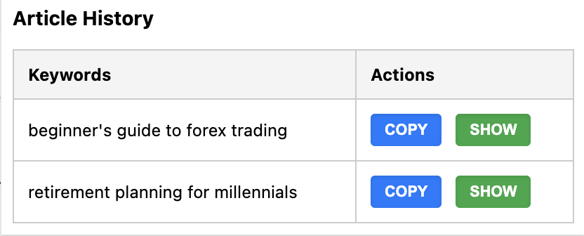

# ArticleGPT

**ArticleGPT** is a Chrome extension designed to generate articles using OpenAI's ChatGPT. This extension allows users to input keywords, select a writing style, and define a word count to produce articles seamlessly. Users can also manage and view their article history within the extension.

---

## **Features**
- Generate articles using OpenAI's ChatGPT API.
- Save articles with associated keywords in a history table for future reference.
- Copy articles to the clipboard in one click.
- View any saved article directly in the output area.
- Configurable options for:
  - Writing style (e.g., Academic, Funny, Sarcastic, etc.).
  - Maximum word count.
  - OpenAI API key (saved locally for convenience).

---

## **Installation**
1. Clone or download this repository.
2. Open Google Chrome and navigate to `chrome://extensions/`.
3. Enable **Developer Mode** (toggle in the top-right corner).
4. Click **Load unpacked** and select the project folder.
5. The extension will now appear in your Chrome toolbar.

---

## **Usage**
1. Click on the ArticleGPT icon in your Chrome toolbar to open the extension.
2. Input the following details:
   - **API Key**: Your OpenAI API key (saved for future use).
   - **Keyword**: The topic for the article.
   - **Writing Style**: Select a style (e.g., Academic, Funny, etc.).
   - **Max Word Count**: Define the maximum number of words for the article.
3. Click **Generate** to create the article.
4. View the generated article in the output area.
   - Use the **Copy** button to copy the article.
5. Check the **Article History** section for previously generated articles.
   - Use the **Copy** or **Show** actions for any saved article.

---

## **Development Notes**
### **File Structure**
- **manifest.json**: Defines the Chrome extension properties and permissions.
- **popup.html**: Main HTML file for the extension's UI.
- **popup.js**: Handles the extension's functionality and API integration.
- **styles.css**: Contains custom styling for the extension.

### **Key Features**
1. **API Integration**:
   - Utilizes OpenAI's ChatGPT API for article generation.
   - Requires an API key to access OpenAI services.
2. **Local Storage**:
   - Articles and API key are saved using `chrome.storage.local`.
   - Data persists even after the browser is closed.
3. **History Management**:
   - Articles are displayed in a table with columns for `Keywords` and `Actions`.
   - Actions include:
     - **Copy**: Copies the article to the clipboard.
     - **Show**: Displays the article in the output container.

---

## **Screenshots**
### Main Interface

### Article History

---

## **Dependencies**
- **OpenAI API Key**: Required for article generation.

---

## **Future Enhancements**
- Add more customization options (e.g., tone, language).
- Export article history to a file (e.g., CSV or PDF).
- Support for multiple keywords in one request.

---

## **Contributing**
1. Fork the repository.
2. Create a new branch: `git checkout -b feature-branch-name`.
3. Commit your changes: `git commit -m "Description of changes"`.
4. Push to the branch: `git push origin feature-branch-name`.
5. Submit a pull request.

---

## **License**
This project is licensed under the MIT License. See the `LICENSE` file for details.

---

## **Acknowledgments**
- **OpenAI** for their incredible ChatGPT API.
- Chrome Extension Developers Guide for inspiration.
